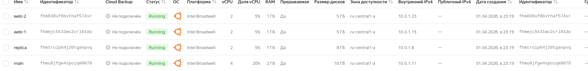
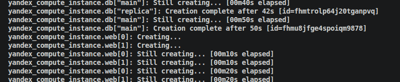

# Решение Домашнего задания к занятию «Управляющие конструкции в коде Terraform»
[Ссылка на репозиторий с кодом](https://github.com/fedinly/netology/tree/6e61e70b812c0f29223ffba7b5cca180857a7f38/Task9/src)  
## Задание 1.
- Скриншот консоли YC
  

## Задание 2.
- Скриншот созданных ВМ
  
- Очередность создания VM:
  

## Задание 3.  
- Скриншоты созданных ВМ и дисков.  
  
    

## Задание 4.
- Скриншот ansible инвент-файла
   
- Инвентарь для серверов из групп webservers, databases позволяет создать боле 2 ВМ, т.к. машины создаются циклически; для ВМ storage динамически создаются только доп.диски, ВМ в единственном экземпляре.
## Задание 5.
- Получилось реализовать способ из нескольких секций output в файле outputs.tf (представлен в репозитории). Данный код не работает для ВМ storage, такжже не получилось реализовать требуемую конкатенацию листов.  
       
## Задание 8.
- Ошибка terrafdorm plan: `Invalid character; This character is not used within the language., and 1 other diagnostic(s).`  
  Необходимо верно расставить закрывающие скобки `}`, т.е. нужно поставить вслед за строкой `"nat_ip_address"]` и убрать в конце строки. Также необходимо убрать пробел в строке `i["platform_id "]`.  
  Скрин hosts.ini после вставки исправленного кода:  
    
